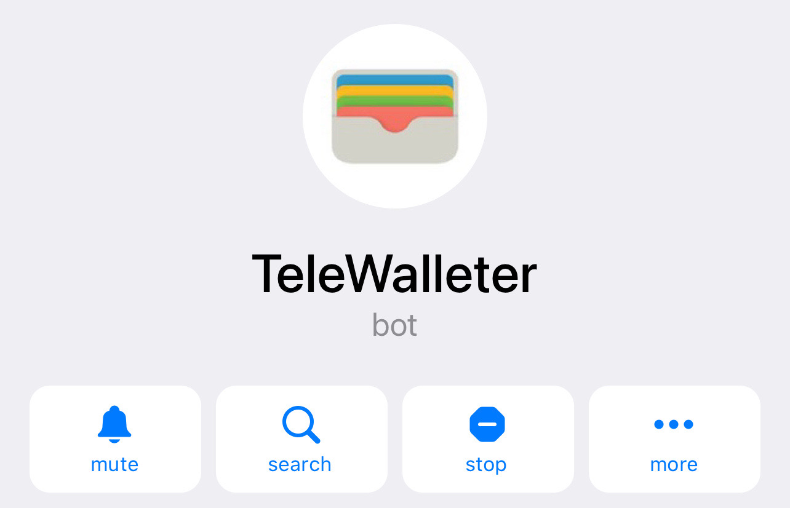
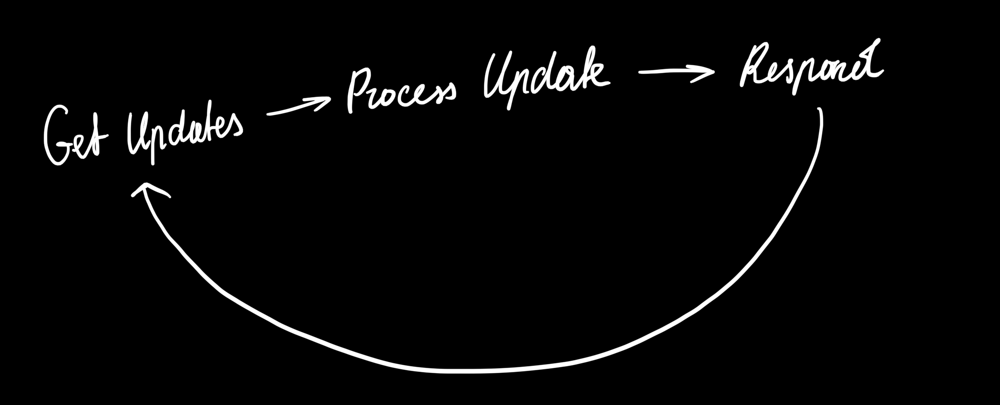
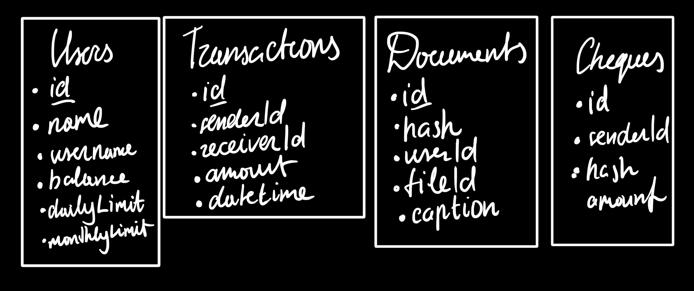

# TeleWalleterBot
### Second year, Winter Semester 2021/2022, Programming in C#

**Goal**: To create a bot that works like a wallet. It will be able to create accounts for users, transfer money from account to account between users, send invoices and money in the message directly using a special link or inline message from the bot. It could also store the user's documents as a picture with a nickname, delete them and send via link. It would support the possibility of setting daily and monthly limits and overview user transactions.

# User Documentation

### Get Started

To launch the bot, you need to download the Telegram app, follow the [link](t.me/TeleWalleterBot) and click Start button.

### Features

* Send funds to friends in seconds!
* Сreate invoice or cheque and send as a link!
* Keep your documents in one safe place!

### Commands

`/topup [AMOUNT]` — top up the balance for the specified amount
 
`/send [AMOUNT] [USERID]` — sends the amount to the user by the specified id
    
`/createinvoice [AMOUNT]` — creates an invoice to receive the specified amount
   
`/createcheque [AMOUNT]`— creates a cheque with the specified amount. The user can get it only if there is a sufficient balance
    
`/dailylimit [AMOUNT]` — sets a daily limit for all operations to the user
  
`/monthlylimit [AMOUNT]` — sets a monthly limit for all operations to the user
   
`/showdocument [DOCUMENTID]` — shows the document to the user
   
`/deletedocument  [DOCUMENTID]` — deletes the document
   
`/deletealldocuments` — deletes all documents

### Inline

After entering @TeleWalleterBot in the text field with another user and then specifying the amount, it becomes possible to send or request the funds directly in the conversation. If you enter `doc` you will be able to see the list of your documents and share it.

# Technical Documentation

### Launching 

To get started you need to connect the Telegram.BotAPI for NET library. Use command `$ dotnet add PROJECT package Telegram.BotAPI`. The bot is launched via `dotnet run` command in the project directory.  The bot will be launched by the link t.me/TeleWalleterBot. If you want to use different bot, use the constructor t.me/BotFather and then change BotUsername and BotToken constants. 

### Main logic

Bot is constantly waiting for a request from the user. When an update is received, it is checked and then the appropriate command is executed. In case of an unsuccessful command, the bot sends a corresponding message.

### Telegram Bot API

The Bot API is an HTTP-based interface. This bot uses three types of updates:
* InlineQuery Update
* Message Update
* CallbackQuery Update

##### `InlineQuery`

The update comes when a user writes a bot username in a dialog with another user and puts a space, then entering the necessary data.

##### `Message`

The update comes when the user sends a message to the bot. The message can contain both a picture, a sticker, an audio file and much more.

##### `CallbackQuery`

The update occurs when the user clicks the InlineKeyboardMarkup button. It allows you to make convenient navigation for the user in the form of a menu.

### Program structure

1. Bot receives an update;
2. Passes the update to processors;
3. Processors based on the data from the user make a decision and change the data if necessary;
4. The corresponding response is sent to the user.

### Main files

##### `Program`
Сreates database tables and starts bot polling.

##### `InlineProcessor`
Processes inline queries from the user and responds to them.

##### `DocumentProcessor`
Handles the document sent by the user and saves it to the database, if successful.

##### `MessageProcessor`
Handles text commands from the user.

##### `CallbackProcessor`
Handles callbacks that the user sends via buttons.

##### `TransactionVerifier`
Сhecks transactions for compliance with the conditions, in particular:
* The required balance
* The correct user ID
* Exceeding limits

##### `TransactionSender`
Sends the transaction if it is valid and notifies users of the changes.

##### `MessageSender`
Sends a message to the user using the Telegram Bot API.

##### `Database`
Executes sql queries to the database.

##### `Constants`
Сontains immutable data, such as error messages, bot token, database name and bot username.

##### `TextGenerator`
Generates text for the user using the transmitted data.

##### `ReplyMarkup`
Creates Reply Markup for messages. The buttons, when pressed, send a call back query to which the bot responds.

##### `HashGenerator`
Сreates a unique hash for later use in the database and obtaining documents. Used to increase user security.

##### `ChequeCreator`
Сreates a cheque and writes it to the database.

### Database structure

### Security of data

The hash of checks and documents is created randomly and protects the user from bruteforce. The user, even knowing the hash of another user's document, will not be able to delete it. The cheque can only be received once if the creator of it has enough funds and limits are not exceeded.

## Course of work
A little difficulty caused the creation of secure links for sending documents and receipts. Also, understanding of the telegram documentation itself and understanding how it interacts with the user and how I can use it in my case.

## Sources that I used:
* [Bots: An introduction for developers](https://core.telegram.org/bots)
* [Telegram Bot API](https://core.telegram.org/bots/api)
* [Telegram.BotAPI](https://github.com/Eptagone/Telegram.BotAPI)
